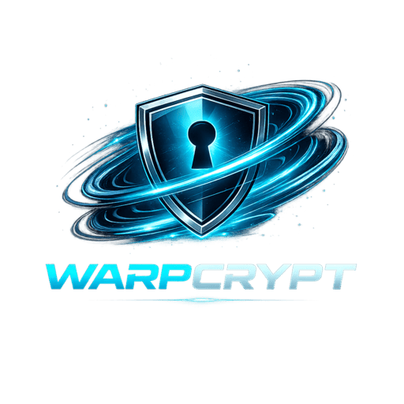

# WarpCrypt

<p align="center">
  
</p>

**WarpCrypt** is a high-performance, CUDA-accelerated cryptography library and CLI.

It provides GPU implementations of some common cryptographic algorithms, enabling high-throughput encryption and decryption for large datasets.

## Features

- Supported algorithms:
  - AES (ECB, CTR)
  - Camellia (ECB, CTR)
  - ChaCha20
- Configurable CUDA execution:
  - Thread blocks
  - Threads per block
  - CUDA streams
- Usable as both:
  - A Rust library
  - A command-line tool (`warpcrypt`)

## Requirements

- Rust installed
- NVIDIA GPU
- CUDA toolkit installed (`nvcc` available)

## CLI Usage

### Installation

```bash
git clone https://github.com/jamesonej22/warpcrypt.git
cd warpcrypt
cargo install --path .
```

### Examples

Encrypt a file using ChaCha20, with a CUDA block size of 192 and 2 CUDA streams:

```bash
warpcrypt encrypt \
    --algorithm chacha20 \
    --ke-_hex 000102030405060708090a0b0c0d0e0f101112131415161718191a1b1c1d1e1f \
    --iv 01000000000000000000004a00000000 \
    --input plaintext.bin \
    --output ciphertext.bin \
    --block-size 192 \
    --num-streams 2
```

Decrypt a file using AES-ECB with key file `key.bin` using 1024 CUDA blocks (of default size 256 threads per block) and default padding (PKCS#7):

```bash
warpcrypt decrypt \
    --algorithm aes-ecb \
    --key-file key.bin \
    --input aes_ciphertext.bin \
    --output aes_plaintext.bin \
    --num-blocks 1024
```

## Library Usage

WarpCrypt exposes a low-level API for execturing cryptographic operations on the GPU.

### Example

Add `warpcrypt` to your Cargo.toml:

```toml
[dependencies]
warpcrypt = "0.1"
```

Then, in your Rust project:

```rust
use warpcrypt::{Algorithm, CryptoRequest, KeySize, Operation, execute_crypto};

let request = CryptoRequest {
    algorithm: Algorithm::ChaCha20,
    operation: Operation::Encrypt,
    key_size: KeySize::KeySize256,
    num_blocks: 256,
    block_size: 256,
    num_streams: 1,
};

let key = vec![0u8; 32];
let iv = vec![0u8; 16]; // counter + nonce
let input = vec![0u8; 1024];
let mut output = vec![0u8; 1024];

execute_crypto(&request, &key, &iv, &input, &mut output);
```

## Notes on Algorithms

- **AES / Camellia (ECB)**
  - Requires block-aligned input or padding (e.g., PKCS#7)
- **AES / Camellia (CTR)**
  - IV is a 16-byte counter block
  - No padding required
- **ChaCha20**
  - Uses a 16-byte IV:
    - 4-byte little-endian counter
    - 12-byte nonce
  - No padding required

## ⚠️ WARNING ⚠️

This project is mostly intended as an academic exercise, and should not yet be used in any cryptographic application where security is essential. USE AT YOUR OWN RISK!

Furthermore, this library assumes:

- Correct key sizes
- Proper IV usage (no reuse in CTR/ChaCha20)

Misuse may result in insecure encryption.

## License

This project is licensed under the [MIT License](LICENSE).
